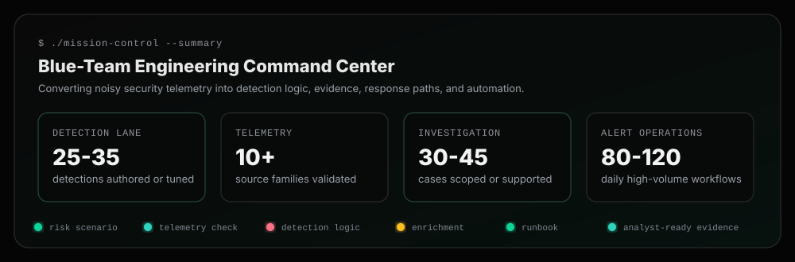
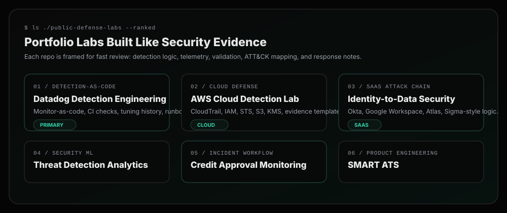
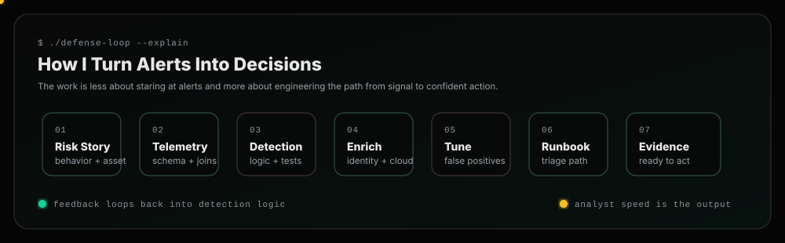
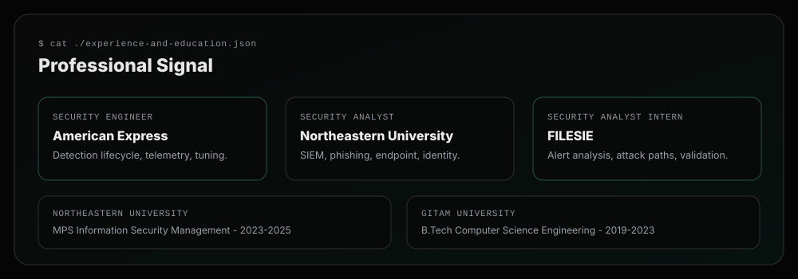

<p align="center">
  
</p>

<p align="center">
  
</p>

<p align="center">
  <a href="https://www.linkedin.com/in/kallabhanu">
    
  </a>
  <a href="https://github.com/Kalla-Bhanu?tab=repositories">
    
  </a>
  
  
</p>

<p align="center">
  <a href="#mission-control">Mission Control</a> |
  <a href="#start-here">Start Here</a> |
  <a href="#defense-labs">Defense Labs</a> |
  <a href="#how-i-defend">How I Defend</a> |
  <a href="#security-arsenal">Security Arsenal</a> |
  <a href="#professional-signal">Professional Signal</a>
</p>

---

## Mission Control

<p align="center">
  
</p>

I build blue-team systems that turn security telemetry into clean detections, enriched evidence, and repeatable response paths. My strongest lane is detection engineering across cloud, identity, endpoint, email, DLP, SIEM, and automation workflows.

```txt
Primary lane     Detection engineering, SIEM tuning, cloud defense, alert validation
Operating style  Risk story -> telemetry check -> detection logic -> enrichment -> runbook
Core tooling     Splunk SPL, Datadog monitor-as-code, AWS, Python, CrowdStrike, Defender, Prisma/Cortex
Outcome          Faster analyst decisions backed by clean evidence
```

---

## Start Here

<p align="center">
  
</p>

| Best first click | Why it matters |
| --- | --- |
| [Datadog Detection Engineering Lab](https://github.com/Kalla-Bhanu/Datadog-Detection-Engineering-Lab) | Detection-as-code discipline: monitor logic, validation harnesses, negative controls, CI checks, ATT&CK mapping, and runbooks. |
| [CloudSec Detection Lab](https://github.com/Kalla-Bhanu/CloudSec-SOC-Detection-Lab) | AWS-first cloud defense with CloudTrail, IAM, STS, S3, EKS, KMS, Lambda replay, and evidence templates. |
| [SaaS Attack Chain Detection Lab](https://github.com/Kalla-Bhanu/SaaS-Attack-Chain-Detection-Lab) | Identity-to-data attack chains across Okta, Google Workspace, and MongoDB Atlas with Sigma-style detections. |

---

## Defense Labs

| Lab | What it proves |
| --- | --- |
| [Datadog Detection Engineering Lab](https://github.com/Kalla-Bhanu/Datadog-Detection-Engineering-Lab) | Monitor-as-code, validation, tuning, CI verification, ATT&CK mapping, and triage runbooks. |
| [CloudSec Detection Lab](https://github.com/Kalla-Bhanu/CloudSec-SOC-Detection-Lab) | Cloud detection engineering with AWS telemetry replay, identity/cloud context, and analyst-ready evidence. |
| [SaaS Attack Chain Detection Lab](https://github.com/Kalla-Bhanu/SaaS-Attack-Chain-Detection-Lab) | SaaS threat modeling with Okta, Google Workspace, Atlas activity, Sigma-style rules, and public-safe artifacts. |
| [security-ml-threat-detection](https://github.com/Kalla-Bhanu/security-ml-threat-detection) | Security analytics, anomaly detection, feature engineering, and high-risk behavior modeling. |
| [soc-monitoring-credit-approval](https://github.com/Kalla-Bhanu/soc-monitoring-credit-approval) | Incident workflow monitoring for sensitive financial and PII processes. |
| [SMART-ATS](https://github.com/Kalla-Bhanu/SMART-ATS) | Product engineering with document parsing, workflow automation, and practical AI-assisted UX. |

---

## How I Defend

<p align="center">
  
</p>

| Phase | What I care about |
| --- | --- |
| Model the risk | What behavior matters, which asset is exposed, and what outcome would hurt. |
| Validate telemetry | Source freshness, schema quality, identity joins, missing context, and false-positive pressure. |
| Build the detection | Explainable logic mapped to behavior and tested with positive and negative cases. |
| Package response | Evidence path, triage questions, escalation notes, and tuning history. |

---

## Security Arsenal

<p align="center">
  
</p>

| Detection & SIEM | Cloud & CNAPP | Identity, Endpoint & Email | Automation & Response |
| --- | --- | --- | --- |
| Splunk SPL | AWS CloudTrail | Entra ID / Azure AD | Python |
| Datadog monitor-as-code | GuardDuty / Security Hub | Duo / Okta concepts | Bash / PowerShell |
| Sigma-style rules | IAM / STS / KMS / S3 | CrowdStrike Falcon | ServiceNow / Jira |
| ATT&CK mapping | Prisma / Cortex Cloud | Microsoft Defender / O365 | Runbooks / RCA |
| False-positive tuning | Vulnerability context | Proofpoint concepts | GitHub Actions |

---

## Professional Signal

<p align="center">
  
</p>

| Role | Signal |
| --- | --- |
| Security Engineer, American Express | Detection lifecycle work across identity, email, endpoint, cloud, DLP, and vulnerability-risk domains. |
| Security Analyst, Northeastern University | Endpoint, identity, phishing, access review, firewall, SIEM, and ServiceNow investigation workflows. |
| Security Analyst Intern, FILESIE | SIEM alert analysis, ATT&CK/OWASP-aligned tuning, attack-path modeling, control validation, and Python dashboards. |

| Education | Timeline |
| --- | --- |
| Northeastern University, Master of Professional Studies in Information Security Management | 2023 - 2025 |
| GITAM University, Visakhapatnam, B.Tech in Computer Science and Engineering | 2019 - 2023 |

---

## Building Next

```txt
roadmap.status = "active"
next.signal    = "richer synthetic telemetry for cloud and identity attack paths"
next.quality   = "better validation harnesses, negative controls, and tuning history"
next.story     = "cleaner incident narratives that connect alerts to analyst decisions"
```

<p align="center">
  
</p>
