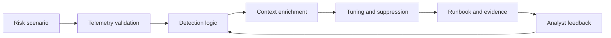

<p align="center">
  
</p>

<p align="center">
  <a href="https://www.linkedin.com/in/kallabhanu">
    
  </a>
  <a href="https://github.com/Kalla-Bhanu?tab=repositories">
    
  </a>
  
  
</p>

<p align="center">
  <a href="#security-signal">Security Signal</a> |
  <a href="#featured-blue-team-labs">Labs</a> |
  <a href="#defensive-workflow">Workflow</a> |
  <a href="#soc-telemetry">SOC Telemetry</a> |
  <a href="#education">Education</a>
</p>

---

## Security Signal

I am a Security Engineer focused on blue-team detection engineering, telemetry automation, incident response, cloud defense, and security analytics. I like building systems that help analysts move from noisy alerts to clear evidence, stronger detections, and repeatable response paths.

```txt
Primary lane     SOC detection engineering, SIEM tuning, cloud defense, alert validation
Operating style  Risk scenario -> telemetry check -> detection logic -> enrichment -> runbook
Core tooling     Splunk SPL, Datadog monitor-as-code, AWS, Python, CrowdStrike, Defender, Prisma/Cortex
Portfolio goal   Build practical security labs that prove how detections work, fail, and improve
```

---

## Why This Profile Matters

| Proof Point | Signal |
| --- | --- |
| Detection engineering | Authored or improved 25-35 detections across identity, email, endpoint, cloud, DLP, and vulnerability-risk domains. |
| Telemetry coverage | Worked across 10+ source families including Splunk, Entra ID, Duo, GlobalProtect, Defender O365/MDE, CrowdStrike, Cortex/Prisma Cloud, Purview DLP, and Qualys. |
| Incident response | Supported investigations across account compromise, MFA abuse, phishing, endpoint behavior, sensitive-data exposure, and cloud exposure. |
| Alert operations | Operated in high-volume SIEM workflows, triaging alerts under critical SLA expectations and turning recurring patterns into durable logic. |
| Cloud security | Built CNAPP/CSPM correlation logic joining misconfigurations, vulnerabilities, identity risk, and runtime signals into remediation context. |

---

## Start Here

| If you are reviewing for... | Open this first |
| --- | --- |
| Detection engineering | [Datadog Detection Engineering Lab](https://github.com/Kalla-Bhanu/datadog-detection-engineering-lab) |
| Cloud/SOC security | [CloudSec SOC Detection Lab](https://github.com/Kalla-Bhanu/CloudSec-SOC-Detection-Lab) |
| Security analytics | [security-ml-threat-detection](https://github.com/Kalla-Bhanu/security-ml-threat-detection) |
| Incident workflows | [soc-monitoring-credit-approval](https://github.com/Kalla-Bhanu/soc-monitoring-credit-approval) |
| Full background | [LinkedIn](https://www.linkedin.com/in/kallabhanu) |

---

## Featured Blue-Team Labs

<table>
  <tr>
    <td width="50%">
      <a href="https://github.com/Kalla-Bhanu/datadog-detection-engineering-lab">
        
      </a>
    </td>
    <td width="50%">
      <a href="https://github.com/Kalla-Bhanu/CloudSec-SOC-Detection-Lab">
        
      </a>
    </td>
  </tr>
  <tr>
    <td width="50%">
      <a href="https://github.com/Kalla-Bhanu/security-ml-threat-detection">
        
      </a>
    </td>
    <td width="50%">
      <a href="https://github.com/Kalla-Bhanu/soc-monitoring-credit-approval">
        
      </a>
    </td>
  </tr>
</table>

| Lab | What to review first |
| --- | --- |
| [Datadog Detection Engineering Lab](https://github.com/Kalla-Bhanu/datadog-detection-engineering-lab) | Monitor-as-code detections, validation cases, negative-control tests, CI verification, ATT&CK mapping, tuning history, and triage runbooks. |
| [CloudSec SOC Detection Lab](https://github.com/Kalla-Bhanu/CloudSec-SOC-Detection-Lab) | AWS-first detection scenarios using CloudTrail/IAM/STS/S3/EKS/KMS context, Lambda synthetic replay, evidence templates, and demo runbooks. |
| [security-ml-threat-detection](https://github.com/Kalla-Bhanu/security-ml-threat-detection) | Security analytics and ML-based anomaly detection for suspicious and high-risk behavior. |
| [soc-monitoring-credit-approval](https://github.com/Kalla-Bhanu/soc-monitoring-credit-approval) | SOC-style monitoring and incident investigation for sensitive financial and PII workflows. |

---

## Experience Snapshot

| Role | What I worked on |
| --- | --- |
| Security Engineer, American Express | Detection lifecycle work across identity, email, endpoint, cloud, DLP, and vulnerability-risk domains, including tuning, enrichment, telemetry checks, ATT&CK mapping, and response documentation. |
| Security Analyst, Northeastern University | Endpoint, identity, phishing, access review, firewall, SIEM, and ServiceNow investigation workflows with NIST-aligned reporting. |
| Security Analyst Intern, FILESIE | SIEM alert analysis, ATT&CK/OWASP-aligned tuning, attack-path modeling, control validation, Python dashboards, and secrets hygiene. |

---

## Detection Engineering Stack

| Detection & SIEM | Cloud & CNAPP | Identity, Endpoint & Email | Automation & Response |
| --- | --- | --- | --- |
| Splunk SPL | AWS CloudTrail | Entra ID / Azure AD | Python |
| Datadog monitor-as-code | GuardDuty / Security Hub | Duo / Okta concepts | Bash / PowerShell |
| Sigma-style rules | IAM / STS / KMS / S3 | CrowdStrike Falcon | ServiceNow / Jira |
| ATT&CK mapping | Prisma / Cortex Cloud | Microsoft Defender / O365 | Runbooks / RCA |
| False-positive tuning | Vulnerability context | Proofpoint concepts | GitHub Actions |

---

## Defensive Workflow



---

## Education

| Program | School | Timeline |
| --- | --- | --- |
| Master of Professional Studies, Information Security Management | Northeastern University | 2023 - 2025 |
| Bachelor of Technology, Computer Science and Engineering | GITAM University, Visakhapatnam | 2019 - 2023 |

Selected focus areas: operating system security, software vulnerabilities, cloud and network security, security analytics, risk management, and CISSP-aligned security domains.

---

## SOC Telemetry

<p align="center">
  
  
</p>

<p align="center">
  
  
</p>

<p align="center">
  
</p>

---

## Building Next

- More realistic synthetic telemetry for cloud and identity attack paths.
- Stronger validation harnesses for detection logic, negative controls, and tuning history.
- Cleaner incident narratives that connect alert evidence to analyst decisions.
- Portfolio labs that are easy for recruiters, hiring managers, and security engineers to evaluate quickly.

---

<p align="center">
  <strong>Blue-team security | Detection engineering | Cloud defense | Security analytics</strong>
</p>
