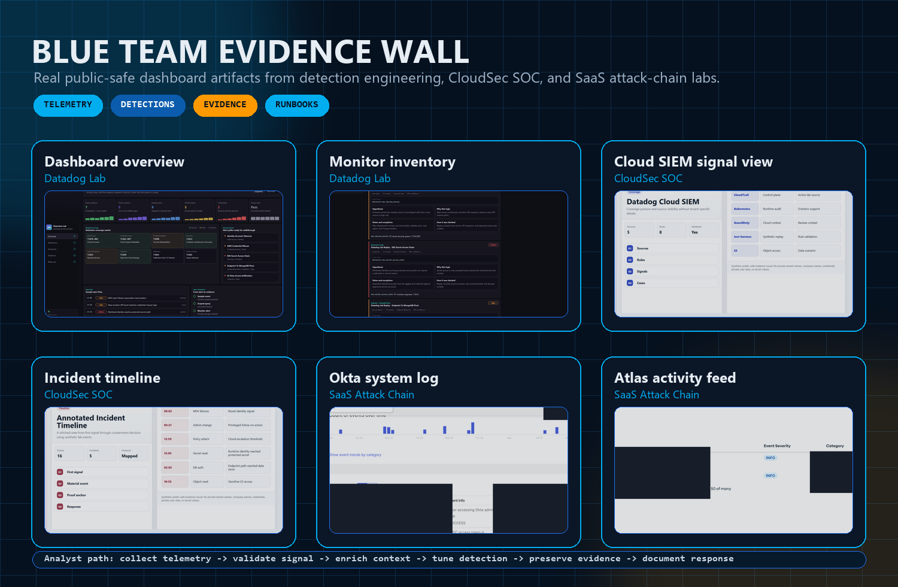
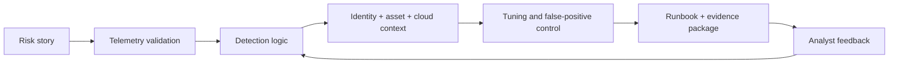

<p align="center">
  
</p>

<p align="center">
  
</p>

<p align="center">
  <a href="https://www.linkedin.com/in/kallabhanu">
    
  </a>
  <a href="https://github.com/Kalla-Bhanu?tab=repositories">
    
  </a>
  
  
</p>

<p align="center">
  <a href="#mission-control">Mission Control</a> |
  <a href="#evidence-wall">Evidence Wall</a> |
  <a href="#start-here">Start Here</a> |
  <a href="#defense-labs">Defense Labs</a> |
  <a href="#how-i-defend">How I Defend</a> |
  <a href="#security-arsenal">Security Arsenal</a>
</p>

---

## Mission Control

I build blue-team systems that convert noisy security telemetry into clear signals, analyst-ready evidence, and repeatable response paths. My work sits where detection engineering, incident response, cloud security, identity, endpoint, email, DLP, and vulnerability context meet.

<table>
  <tr>
    <td align="center"><strong>25-35</strong><br />detections authored or improved</td>
    <td align="center"><strong>10+</strong><br />telemetry source families</td>
    <td align="center"><strong>30-45</strong><br />investigations scoped or supported</td>
    <td align="center"><strong>80-120</strong><br />SIEM alerts/day handled in high-volume workflows</td>
  </tr>
</table>

```txt
Primary lane     SOC detection engineering, SIEM tuning, cloud defense, alert validation
Operating style  Risk scenario -> telemetry check -> detection logic -> enrichment -> runbook
Core tooling     Splunk SPL, Datadog monitor-as-code, AWS, Python, CrowdStrike, Defender, Prisma/Cortex
Security goal    Make the analyst's next decision faster, clearer, and better supported by evidence
```

---

## Evidence Wall

<p align="center">
  
</p>

This profile is built around public-safe artifacts from real labs: detection dashboards, monitor inventories, Cloud SIEM signal views, incident timelines, Okta logs, and Atlas activity evidence.

---

## Start Here

<table>
  <tr>
    <td width="50%">
      <h3>Detection Engineering</h3>
      <p>Review monitor-as-code detections, validation cases, negative controls, CI checks, ATT&CK mapping, and runbooks.</p>
      <a href="https://github.com/Kalla-Bhanu/datadog-detection-engineering-lab"><strong>Open Datadog Detection Engineering Lab</strong></a>
    </td>
    <td width="50%">
      <h3>Cloud SOC</h3>
      <p>Review AWS-first detections using CloudTrail, IAM, STS, S3, EKS, KMS, Lambda replay, and evidence templates.</p>
      <a href="https://github.com/Kalla-Bhanu/CloudSec-SOC-Detection-Lab"><strong>Open CloudSec SOC Detection Lab</strong></a>
    </td>
  </tr>
  <tr>
    <td width="50%">
      <h3>SaaS Attack Chains</h3>
      <p>Review identity-to-data paths across Okta, Google Workspace, and MongoDB Atlas with Sigma-style detections and evidence artifacts.</p>
      <a href="https://github.com/Kalla-Bhanu/SaaS-Attack-Chain-Detection-Lab"><strong>Open SaaS Attack Chain Detection Lab</strong></a>
    </td>
    <td width="50%">
      <h3>Incident Workflows</h3>
      <p>Review SOC-style monitoring for financial and PII workflows, including evidence-driven investigation paths.</p>
      <a href="https://github.com/Kalla-Bhanu/soc-monitoring-credit-approval"><strong>Open SOC Monitoring Credit Approval</strong></a>
    </td>
  </tr>
</table>

---

## Defense Labs

| Lab | What it proves |
| --- | --- |
| [Datadog Detection Engineering Lab](https://github.com/Kalla-Bhanu/datadog-detection-engineering-lab) | Detection-as-code discipline: validation harnesses, negative controls, CI verification, tuning history, ATT&CK mapping, and triage runbooks. |
| [CloudSec SOC Detection Lab](https://github.com/Kalla-Bhanu/CloudSec-SOC-Detection-Lab) | Cloud detection engineering: AWS telemetry replay, identity/cloud context, evidence templates, and analyst-ready runbooks. |
| [SaaS Attack Chain Detection Lab](https://github.com/Kalla-Bhanu/SaaS-Attack-Chain-Detection-Lab) | SaaS threat modeling: Okta, Google Workspace, and MongoDB Atlas attack chains with Sigma-style detections and public-safe evidence. |
| [security-ml-threat-detection](https://github.com/Kalla-Bhanu/security-ml-threat-detection) | Security analytics: anomaly detection, feature engineering, and high-risk behavior modeling. |
| [soc-monitoring-credit-approval](https://github.com/Kalla-Bhanu/soc-monitoring-credit-approval) | Incident investigation: monitoring, sensitive-data risk, and SOC-style evidence collection for regulated workflows. |

---

## How I Defend



<table>
  <tr>
    <td><strong>1. Model the risk</strong><br />What behavior matters, which asset is exposed, and what outcome would hurt?</td>
    <td><strong>2. Validate telemetry</strong><br />Confirm the source, schema, freshness, identity joins, and missing context before trusting alerts.</td>
  </tr>
  <tr>
    <td><strong>3. Build the detection</strong><br />Create logic that is explainable, mapped to behavior, and testable with positive and negative cases.</td>
    <td><strong>4. Package the response</strong><br />Write the evidence path, triage questions, escalation notes, and tuning history so analysts can move fast.</td>
  </tr>
</table>

---

## Security Arsenal

<p align="center">
  
</p>

| Detection & SIEM | Cloud & CNAPP | Identity, Endpoint & Email | Automation & Response |
| --- | --- | --- | --- |
| Splunk SPL | AWS CloudTrail | Entra ID / Azure AD | Python |
| Datadog monitor-as-code | GuardDuty / Security Hub | Duo / Okta concepts | Bash / PowerShell |
| Sigma-style rules | IAM / STS / KMS / S3 | CrowdStrike Falcon | ServiceNow / Jira |
| ATT&CK mapping | Prisma / Cortex Cloud | Microsoft Defender / O365 | Runbooks / RCA |
| False-positive tuning | Vulnerability context | Proofpoint concepts | GitHub Actions |

---

## Field Experience

| Role | What I worked on |
| --- | --- |
| Security Engineer, American Express | Detection lifecycle work across identity, email, endpoint, cloud, DLP, and vulnerability-risk domains, including tuning, enrichment, telemetry checks, ATT&CK mapping, and response documentation. |
| Security Analyst, Northeastern University | Endpoint, identity, phishing, access review, firewall, SIEM, and ServiceNow investigation workflows with NIST-aligned reporting. |
| Security Analyst Intern, FILESIE | SIEM alert analysis, ATT&CK/OWASP-aligned tuning, attack-path modeling, control validation, Python dashboards, and secrets hygiene. |

---

## Education

| Program | School | Timeline |
| --- | --- | --- |
| Master of Professional Studies, Information Security Management | Northeastern University | 2023 - 2025 |
| Bachelor of Technology, Computer Science and Engineering | GITAM University, Visakhapatnam | 2019 - 2023 |

Selected focus areas: operating system security, software vulnerabilities, cloud and network security, security analytics, risk management, and CISSP-aligned security domains.

---

## Building Next

- Richer synthetic telemetry for cloud and identity attack paths.
- Better validation harnesses for detection logic, negative controls, and tuning history.
- Cleaner incident narratives that connect alert evidence to analyst decisions.
- Portfolio labs that security engineers and recruiters can evaluate quickly.

---

<p align="center">
  
</p>
